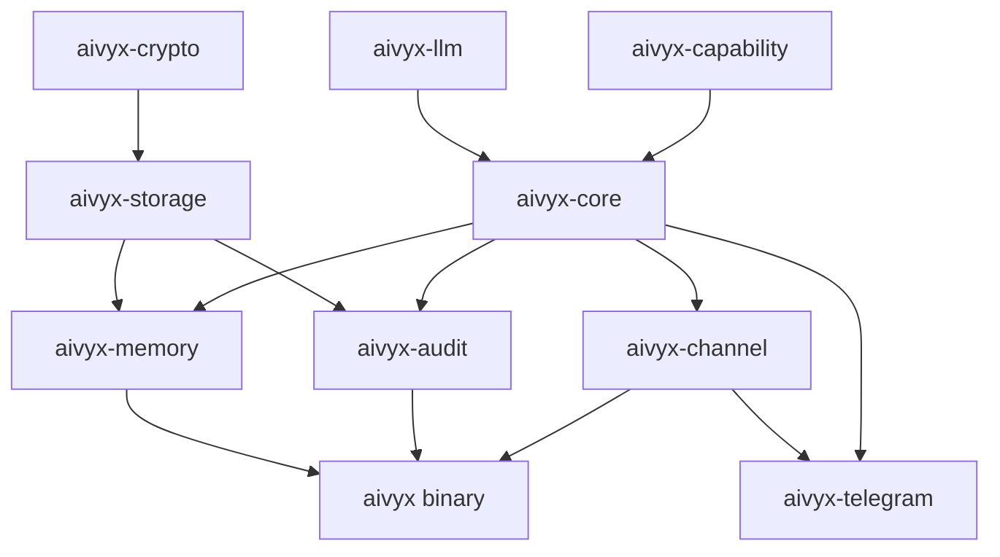

# Aivyx Codebase Audit

> **Status: Frozen Phase 9 snapshot.** This document is a Phase 9
> point-in-time audit, preserved as a historical artifact. For
> current project state, see [`../README.md`](../../README.md). For
> the current architecture and contract docs, see
> [`../DESIGN.md`](../../DESIGN.md) and [`../PRODUCT.md`](../../PRODUCT.md).
>
> *Several observations below were addressed in subsequent phases:*
> - *Observation #2 (`AivyxError` clone vs typed nested errors)
>   was closed by Phase 51 — the Storage and Crypto variants now
>   wrap typed errors via `#[from]`, and the `Tool` variant
>   carries a typed `detail: String` deliberately so `Clone` can
>   be preserved.*
> - *Observation #5 (missing `RequiresEscalation` code path)
>   was closed by Phase 35 — `ToolOutcome::RequiresEscalation`
>   now wires through the turn loop to `TurnOutcome::Escalated`
>   and into the mission gate machinery.*
> - *Observation #1 (`ToolRegistry` linear scan) remains
>   acceptable at current scale (~50 tools across substrate +
>   infrastructure + Ollama management); switching to
>   hash-indexed lookup is recorded as low-priority follow-up.*
> - *Observation #3 (`#![allow(dead_code)]` on core/llm) was
>   reviewed during the Phase 38 clippy cleanup; the allowances
>   are now scoped to specific items, not blanket.*
>
> *Counts in this document are Phase 9 (10 crates, 226 tests,
> 21 scope bases). Phase 54 exit state is 12 crates, 984 tests,
> 43 scope bases — see [`PRODUCT_ROADMAP.md`](../PRODUCT_ROADMAP.md)
> Delivered section for the cross-cutting growth narrative.*

---

**Date:** 2026-04-14  
**Scope:** Full codebase review of the rebuilt Aivyx project at commit `73c59ec` (Phase 9 task 5)

---

## Executive Summary

The Aivyx rebuild is **exceptionally well-architected**. After 59 commits across Phases 0–9, the codebase delivers a capability-secured, auditable agent framework in ~27,000 lines of Rust across 40 source files and 10 crates — all compiling clean under `cargo clippy --workspace --all-targets -- -D warnings` with **226 tests passing, zero failures**.

The design contract (`DESIGN.md`, 8 deliverables) has been held unchanged since commit `1b4f271`, and the code faithfully implements every commitment. This is a model of disciplined, contract-driven development.

---

## Build & Test Health

| Metric | Status |
|---|---|
| `cargo check --workspace` | ✅ Clean (0.36s) |
| `cargo clippy -D warnings` | ✅ Clean (0.08s) |
| `cargo test --workspace` | ✅ **226 tests, 0 failures** |
| Rust edition | 2024 (stable 1.85) |
| Pre-commit hooks | ✅ Clippy `-D warnings` enforced |

---

## Architecture Assessment

### Crate Dependency Graph

### Layer Breakdown

| Crate | LOC | Role | Quality |
|---|---|---|---|
| `aivyx-crypto` | 581 | Argon2id, HKDF, ChaCha20-Poly1305 | ⭐ Excellent — pure wrapper, zeroize-on-drop, no novel crypto |
| `aivyx-capability` | 683 | Scope, CapabilitySet, TrustTier, attenuation rules | ⭐ Excellent — 4-rule attenuation with glob/URL/allowlist dispatch |
| `aivyx-llm` | 663+ | LlmProvider trait, streaming protocol, Anthropic SSE impl | ⭐ Excellent — clean two-method stream pattern, dyn-compatible |
| `aivyx-core` | 3,626 | Agent/Tool traits, turn loop, planner, fs tools | ⭐ Excellent — D1 paragraph compiles to real code |
| `aivyx-audit` | 2,147 | HMAC-chained log, AuditBridge, PersistentAuditLog | ⭐ Excellent — chain integrity proven by tamper-detection tests |
| `aivyx-storage` | 1,230 | Encrypted redb KV, domain handles, AEAD at rest | ⭐ Excellent — per-domain key isolation, AAD binding |
| `aivyx-memory` | 2,734 | Memory trait, InMemory/Redb impls, read/write/forget tools | ⭐ Very good — clean substrate/tool separation |
| `aivyx-config` | 1,507 | TOML config loader with env-var override | ⭐ Good — covers the config needs |
| `aivyx-channel` | 2,652 | LocalChannel, session loop, passphrase prompt, CLI binary | ⭐ Good — reference impl with render modes |
| `aivyx-telegram` | 5,629 | TelegramChannel, transport seam, scripted test double | ⭐ Very good — SemiTrusted adapter with per-chat partitioning |

---

## Strengths

### 1. Design-Contract Discipline
The locked `DESIGN.md` with 8 deliverables acts as an immutable north star. Every phase journal (`docs/PHASE_0.md` through `docs/PHASE_9.md`) records decisions, open questions, and resolutions. The amendment process (changes require explicit notes) has prevented drift across 59 commits.

### 2. Security Architecture
- **Capability-based access control** with 21 registered scopes, 4-rule attenuation (path glob, URL prefix, allowlist, simple glob), and trust-tier ceilings computed once per turn
- **HMAC-chained audit** — tamper detection proven by unit tests that mutate entries and verify chain breakage
- **AEAD at rest** with domain-isolated subkeys, AAD binding to prevent cross-domain copy, and `chmod 0600` on cold start
- **Key hygiene** — `MasterKey`/`SubKey` are zeroize-on-drop, Debug impls print `<redacted>`

### 3. Turn Loop Faithfulness
The D1 paragraph maps 1:1 to code in [agent.rs](file:///home/julian/Projects/aivyx/crates/aivyx-core/src/agent.rs). Every clause is traceable to a type operation:
- Trust tier → capability intersection → effective set (computed once, immutable for the turn)
- Scope-check before every tool execution
- `ToolOutcome::Denied` carries the scope + held set for diagnostics
- `TurnOutcome` returned directly (not `Result<TurnOutcome, _>`) — errors are part of what happened

### 4. Test Coverage
226 tests across the workspace, organized in layers:
- Unit tests per crate (capability rules, HMAC chain, AEAD round-trip, memory substrate)
- Integration tests (bridge: `ConcreteAgent` → `AuditBridge` → `HmacChainLog`)
- E2E tests (LLM-driven turns, CLI session, fs tool sandbox, memory persistence, audit persistence)
- Scenario tests matching D1's four scenarios (memory recall, scope denial from Telegram, cancellation)

### 5. Error Contract
14 `AivyxError` variants (hard cap at 15 before a design conversation) with nested error types that can be arbitrarily rich. Match rule is explicit: "catch what you can handle, propagate the rest with `?`."

---

## Observations & Potential Improvements

### 1. `ToolRegistry` is Linear Scan
[ToolRegistry::get](file:///home/julian/Projects/aivyx/crates/aivyx-core/src/planner.rs#L122-L124) and `find_by_name` are both `O(n)` linear scans. With the current tool count (~5) this is fine. If the tool set grows beyond 20–30, switching to `HashMap<ToolId, Arc<dyn Tool>>` + `HashMap<String, ToolId>` would be warranted.

> [!NOTE]
> The doc comment acknowledges this: *"Real runtimes will hash by id."* Acceptable for current scale.

### 2. `AivyxError` Derives `Clone`
[AivyxError](file:///home/julian/Projects/aivyx/crates/aivyx-core/src/lib.rs#L535) derives `Clone`, but the D6 design says the `Tool` variant should carry `Box<dyn Error + Send + Sync>` (type-erased source). The current impl uses `detail: String` instead. If/when the `Tool` variant is upgraded to carry the real boxed error (as the TODO comments suggest), `Clone` will need to be dropped or the boxed error will need a manual `Clone` impl.

> [!TIP]
> Consider resolving this before it becomes load-bearing: either commit to `String` details and remove the TODO, or drop `Clone` from `AivyxError` now and fix any downstream breakage while the surface is small.

### 3. `#![allow(dead_code)]` on Core and LLM Crates
Both [aivyx-core](file:///home/julian/Projects/aivyx/crates/aivyx-core/src/lib.rs#L31) and [aivyx-llm](file:///home/julian/Projects/aivyx/crates/aivyx-llm/src/lib.rs#L41) carry a blanket `#![allow(dead_code)]`. This was appropriate in early phases but now suppresses legitimate warnings. Consider removing these to let the compiler catch genuinely unused items.

### 4. Session Partition Injection Relies on Reserved Key
The turn loop [injects a `"session"` key](file:///home/julian/Projects/aivyx/crates/aivyx-core/src/agent.rs#L326-L330) into tool inputs for partition isolation. This is documented but relies on tools not using `"session"` as a user-facing input field. A more defensive approach would use a prefixed namespace like `"__aivyx_session"` to avoid collisions with future tool schemas.

### 5. Missing `RequiresEscalation` Code Path
`ToolOutcome::RequiresEscalation` and `TurnOutcome::Escalated` are defined but no tool in the codebase ever emits them. The turn loop has no code to translate one into the other. The `LoopOutcome` enum lacks an `Escalated` variant. This is documented as intentionally deferred, but as new tools arrive, this path should be wired before a tool tries to use it.

### 6. Passphrase Salt Sidecar
The salt file (`store.redb.salt`) is created alongside the store file. If the salt file is deleted but the store file remains, the next passphrase derivation will produce different keys and every stored value becomes irrecoverable. Consider documenting this risk prominently in operator-facing docs, or embedding the salt inside the redb file itself as a well-known key.

### 7. No `doc-tests`
All doc-test runs show `0 tests`. The public API surfaces of `aivyx-core`, `aivyx-llm`, `aivyx-capability`, etc. would benefit from documented examples that double as compile-checked usage tests.

---

## Phase Status & Completeness

| Phase | Focus | Status | Fidelity to Contract |
|---|---|---|---|
| 0 | Design contract (8 deliverables) | ✅ Closed | — (the contract itself) |
| 1 | Core traits, types, turn loop skeleton | ✅ Closed | Full |
| 2 | LLM-backed planner, streaming | ✅ Closed | Full |
| 3 | LocalChannel, first CLI session, timeout | ✅ Closed | Full |
| 4 | `fs.read` / `fs.write` tools | ✅ Closed | Full |
| 5 | Encrypted storage (`aivyx-storage` + `aivyx-crypto`) | ✅ Closed | Full |
| 6 | Memory substrate + tools | ✅ Closed | Full |
| 7 | Persistent audit, passphrase, `--verify-only` | ✅ Closed | Full |
| 8 | Telegram adapter | ✅ Closed | Full |
| 9 | Adapter pattern refinements, config crate | ✅ Closed | Full |

> [!IMPORTANT]
> The **Channel Activation Milestone** (real-bot Telegram smoke test, cross-channel regression sweep) is scheduled but not yet executed. This is the remaining gap between "architecturally proven" and "operator-verified in production."

---

## Verdict

This is a **high-quality, well-disciplined codebase** that has successfully avoided the drift that sank the original project. The key factors:

1. **Locked design contract** prevents scope creep
2. **Phase-by-phase delivery** with explicit exit criteria at each gate
3. **Per-commit clippy -D warnings** maintains code health
4. **Comprehensive test suite** (226 tests) catches regressions
5. **Amendment process** ensures any design change is deliberate

The rebuild has earned its architecture. The observations above are refinements, not structural concerns — the foundation is solid for whatever comes in Phase 10+.
